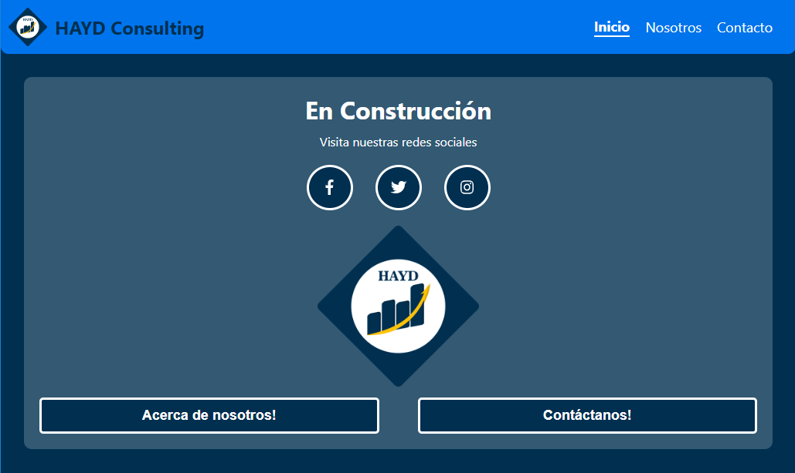
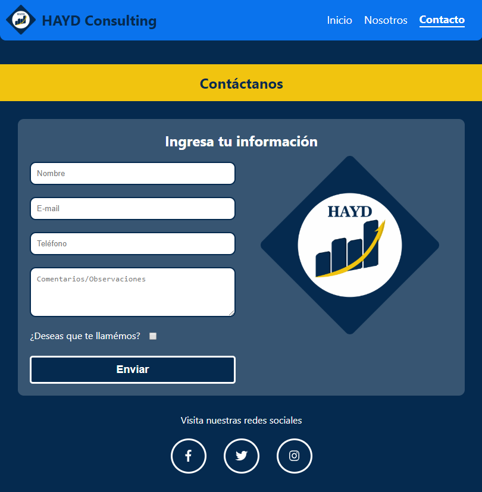

# HAYD Consulting Website

Temporal Website for HAYD Consulting developed with NextJS

## ¿How it works?

Require Node.JS

* `npm install` For instailling dependencies.
* `npm run dev` For developing environment.
* `npm run build && npm start` For production environment.

## Author & Credits

- [William Velazquez](https://twitter.com/@WilliamVlazquez)

## Screenshots

